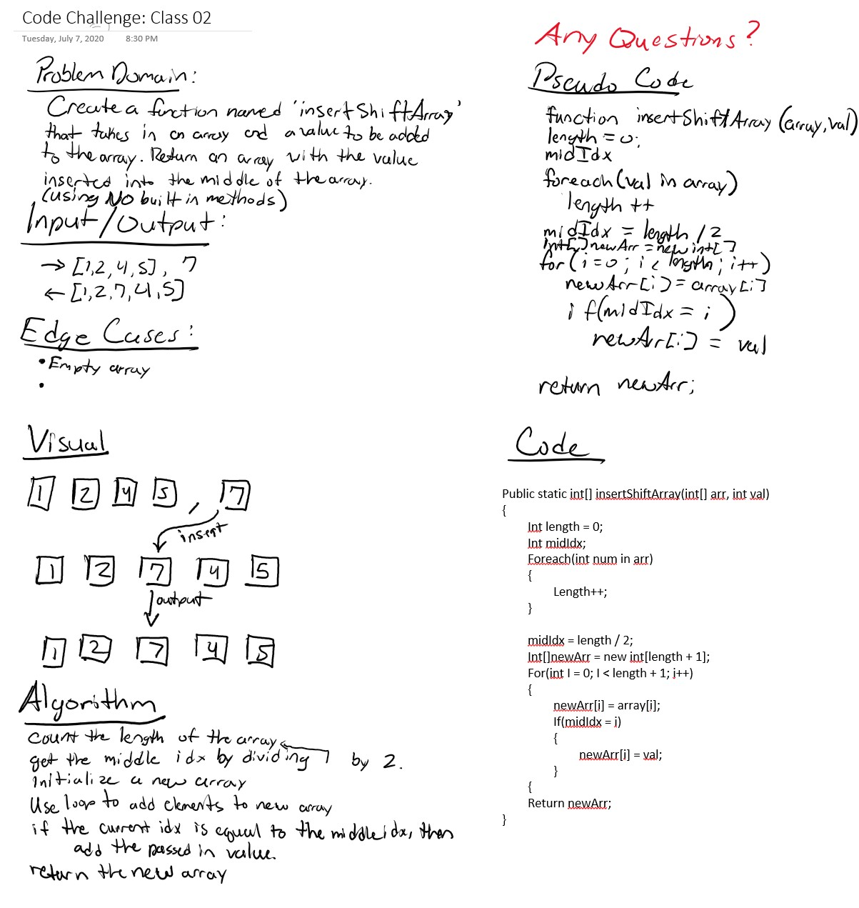

# Challenges
---

## Insert Array Shift

*Author: Andrew Smith*

---

## Problem Domain

Given an array and a value, add the value to the middle of the array. Built in methods are not allowed.

---

## Inputs / Outputs

| Input              | Output            |
| ------------------ | ----------------- |
| [2,4,6,8], 5       | [2,4,5,6,8]       |
| [4,8,15,23,42], 16 | [4,8,15,16,23,42] |

---

## Visuals

WhiteBoard

---

## Change Log

7 June 2020
  * Added InsertShiftArray() method
