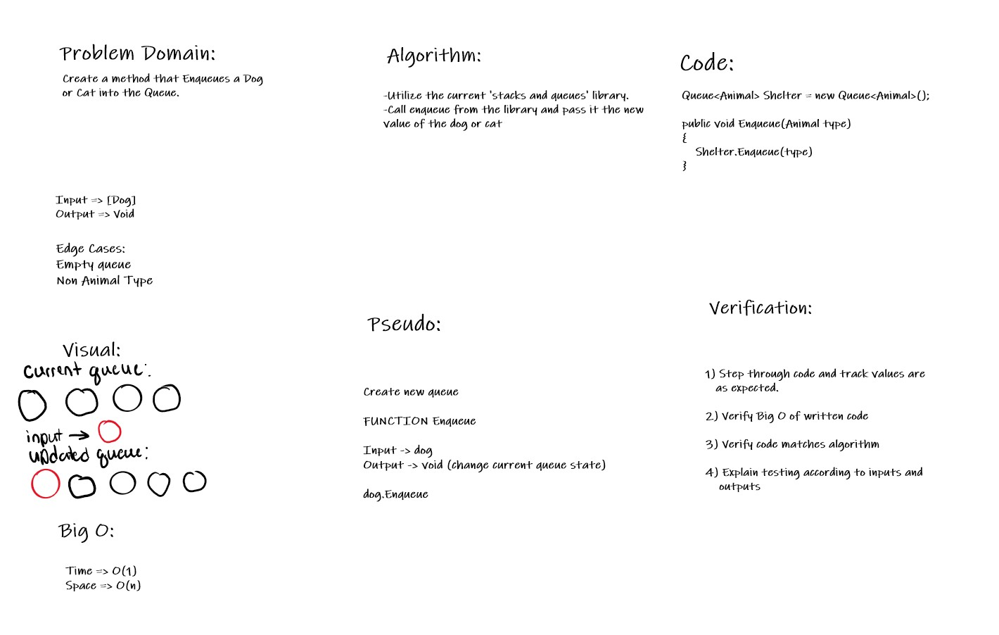

# FIFO (First In First Out) Animal Shelter

Code Challenge 12

*Author: Andrew Smith*

---
### Description

This console app uses the 'stacks and queues' library. The animal shelter is a queue
structure that receives a Cat or Dog object into the queue. A Car or Dog is then able 
to be Dequeued from the shelter.

---

### Method Descriptions

**Enqueue()**
- Time - O(1)
- Space - O(n)

Enqueues a dog or cat instance into a queue

**Dequeue()**
- Time - 
- Space - 

Dequeues a dog or cat instance from a queue

**Peek()**
- Time - O(1)
- Space - O(1)

Returns the value of the first object in the queue

---

### Method Approaches

**Enqueue()**
- Invoke the Enqueue method from the stacks and queues library

**Dequeue()**
- If the passed in parameter is of type Animal
  - Invoke and return the value from the Dequeue() within stacks and queues library
- If it is not of type Animal
  - Return null

**Peek()**
- Invoke and return the value from the Peek() within the stacks and queues library

---

### White-board Visual

---

### Change Log

- 1.5 Add white board visual - 21 Jul 2020
- 1.4 Add Peek() - 21 Jul 2020
- 1.3 Add unit tests for Enqueue() and Dequeue() - 21 Jul 2020
- 1.2 Add Dequeue() - 21 Jul 2020
- 1.1 Add Enqueue() - 21 Jul 2020
- 1.0 Add Animal, AnimalShelter, Dog and Cat classes - 21 Jul 2020

