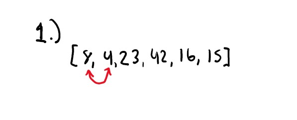

# Insertion Sort

Code Challenge 26

*Author: Andrew Smith*

---
### Description

An insertion sort is a sorting method which traverses through an array linearly and compares the current value
with the previous value. If the current value is less (or greater, depending on what the sorting algorithm does) than 
the previous value, then replace them. This occurs over and over again until the entire array is sorted. 

---

### PseudoCode

```
  InsertionSort(int[] arr)
  
    FOR i = 1 to arr.length
    
      int j <-- i - 1
      int temp <-- arr[i]
      
      WHILE j >= 0 AND temp < arr[j]
        arr[j + 1] <-- arr[j]
        j <-- j - 1
        
      arr[j + 1] <-- temp
```

---

### Trace

Sample Array `[8, 4, 23, 42, 16, 15]`

Pass 1:

4 is less than 8, so position 4 before 8.



Pass 2: 

8 is already less than 23, no change needed.


Pass 3:

23 is already less than 42, no change needed.


Pass 4:


Pass 5:

16 is less than 42 and 23, so position is before 23.


Pass 6: 

15 is less than 42, 23 and 16, so position it before 16. 


Pass 7:

Array is sorted. No change needed.


---

### Efficency

---


