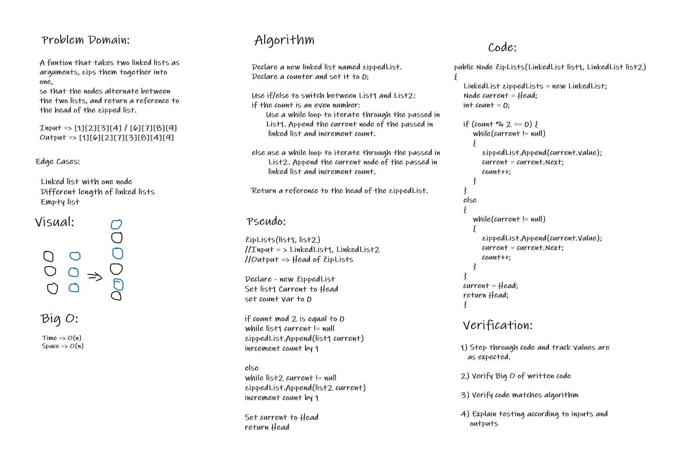

# Zip Two Linked Lists

*Author: Andrew Smith*

---

### Problem Domain

Write a method that accepts two linked lists as arguments. Given these two lists, create a new linked
list with both of the passed in lists merged together. The head node of the new list should be the
head node of the first passed in list and then alternating each node. This methods from 
the previously built 'LinkedListLibrary' can be used to accomplish this.

---

### Inputs and Outputs

Input => [1][5][7][9]  /  [2][3][8][10]
Output => [1][2][5][3][7][8][9][10]

---

### Big O

---

### White board Visual

---

### Change Log

15 July 2020
* Added white board visual
