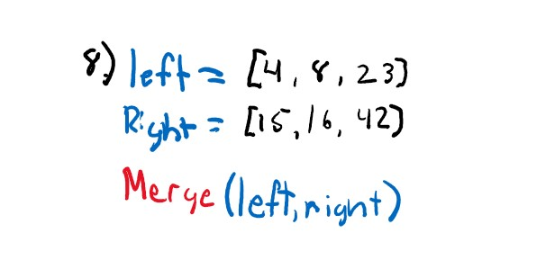

# Merge Sort

Code Challenge 27

*Author: Andrew Smith*

---

### Description 

The sorting approach of a merge sort consists of recursively breaking down an array until it can 
evaluate single nodes. Those nodes are then compared with one another and placed in the correct
position.

---

### PseudoCode

```json
ALGORITHM Mergesort(arr)
    DECLARE n <-- arr.length
           
    if n > 1
      DECLARE mid <-- n/2
      DECLARE left <-- arr[0...mid]
      DECLARE right <-- arr[mid...n]
      // sort the left side
      Mergesort(left)
      // sort the right side
      Mergesort(right)
      // merge the sorted left and right sides together
      Merge(left, right, arr)

ALGORITHM Merge(left, right, arr)
    DECLARE i <-- 0
    DECLARE j <-- 0
    DECLARE k <-- 0

    while i < left.length && j < right.length
        if left[i] <= right[j]
            arr[k] <-- left[i]
            i <-- i + 1
        else
            arr[k] <-- right[j]
            j <-- j + 1
            
        k <-- k + 1

    if i = left.length
       set remaining entries in arr to remaining values in right
    else
       set remaining entries in arr to remaining values in left
```

*Pseudo code retrieved from assignment instructions:* - [Link to Pseudo Code](https://canvas.instructure.com/courses/2134291/assignments/15977777?return_to=https%3A%2F%2Fcanvas.instructure.com%2Fcalendar%23view_name%3Dmonth%26view_start%3D2020-08-12)

---

### Trace

Sample array - `[8,4,23,42,16,15]`

1.  Split the array in half based on the midpoint. 


2. First evaluate the left hand side array. Once again, split the array based on the midpoint.


3. Since the left half (`[8]`) is down to a single node, move on and evaluate the right half. 


4. Split the array in half based on the midpoint.


5. All values are down to a single node, now swap them into their correct positions.


6. Now that the left side of the original array is sorted, move on and sort the right half.
   Split the array based on the midpoint.


7. All values are down to a single node, now swap them into their correct positions.


8. Now that the left and right hand side of the original array, invoke the 'Merge()' method
   with the left side of the array and right side of the array as arguments. 



9. Now evaluate all nodes and swap them into their correct positions.


---

### Efficiency

- Time: O(n log n)
- Space: O(n)

---

### Credit

Much of my solution was derived from this instructional video by Johnathon Kwisses. In the video,
he breaks down the problem in depth using Java. 

[Johnathon Kwisses Youtube Video](https://www.youtube.com/watch?v=yv6svAfoYik)

