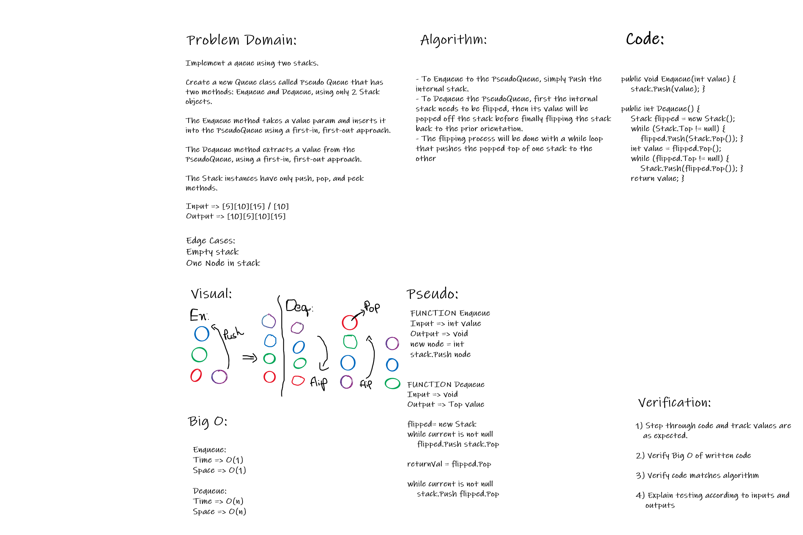

# Queue with Stacks

Code Challenge 11

*Author: Andrew Smith*

---
### Description

This library is an implementation of a stack, but with a queue approach. Instead of 
using a stacks FILO (First in last out) approach, it uses a FIFO (First in first out)
approach.

---

### Method Descriptions

**Enqueue()**

Time - O(n)

Space - O(n)

Enqueues a value into the PseudoQueue(stack) with a FIFO(first in first out) 
approach.

**Dequeue()**

Time - O(n)

Space - O(n)

Dequeues a value from the PseudoQueue with a FIFO approach.

---

### Method Approaches

- **Enqueue**
  - Push value into stack if stack is null
  - Create new stack
  - While the current stack's top's value is not null
    - Pop the value of the current stack and push into new stack
  - Push passed in value into the new stack
  - While the new stack's top's value is not null
    - Pop the value of the new stack and push into the old stack

- **Dequeue()**
  - Throw exception if the stacks top value is null
  - Create new temp stack
  - While the old stack's top's value is not null
    - Pop the value of the old stack and push into new temp stack
  - Pop of temp stacks value and store in a return variable
  - While the temp stack's top's value is not null
    - Pope the value of the temp stack and push into the old stack
  - Return the stored variable

---

### White-board Visual

---

### Change Log

- 1.4 Library Complete - 20 July 2020
- 1.3 Unit test of Dequeue() - 20 July 2020
- 1.2 Dequeue() - 20 July 2020
- 1.1 Unit test for Enqueue() - 20 July 2020
- 1.0 Enqueue() - 20 July 2020