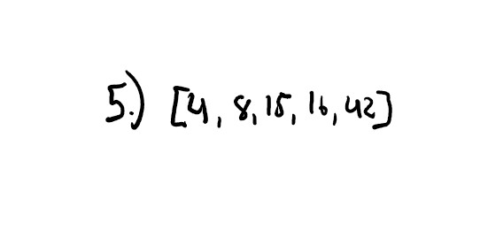

# Quick Sort

Code Challenge 28

*Author: Andrew Smith*

---

### Description 

A quick sort algorithm continuously *partitions* the array by randomly choosing (most cases the 
far right index position) a *pivot* point. All of the elements in the array are then compared with 
this pivot point. All values less will go on the left side, all values greater will go on the 
right side. This is then done again with the two partitioned arrays until a single value is reached. 
Then the elements are swapped as necessary and added back together to form a sorted list.

---

### PseudoCode

```
ALGORITHM QuickSort(arr, left, right)
    if left < right
        // Partition the array by setting the position of the pivot value 
        DEFINE position <-- Partition(arr, left, right)
        // Sort the left
        QuickSort(arr, left, position - 1)
        // Sort the right
        QuickSort(arr, position + 1, right)

ALGORITHM Partition(arr, left, right)
    // set a pivot value as a point of reference
    DEFINE pivot <-- arr[right]
    // create a variable to track the largest index of numbers lower than the defined pivot
    DEFINE low <-- left - 1
    for i <- left to right do
        if arr[i] <= pivot
            low++
            Swap(arr, i, low)

     // place the value of the pivot location in the middle.
     // all numbers smaller than the pivot are on the left, larger on the right. 
     Swap(arr, right, low + 1)
    // return the pivot index point
     return low + 1

ALGORITHM Swap(arr, i, low)
    DEFINE temp;
    temp <-- arr[i]
    arr[i] <-- arr[low]
    arr[low] <-- temp
```

Pseudo code derived from assignment instructions [here](https://canvas.instructure.com/courses/2134291/assignments/15977778?return_to=https%3A%2F%2Fcanvas.instructure.com%2Fcalendar%23view_name%3Dmonth%26view_start%3D2020-08-12)

---

### Trace

Sample array -> `[8,4,23,42,16,15]`


1. Pick a pivot point from the array and compare all the values with it. If they are less than 
   the pivot, they go on the left hand side, if they are greater, they go on the right. 


2. Swap the left hand side values.


3. Pick another pivot point in the right hand side array and do another comparison. 


4. Swap the values.


5. The array is now sorted.



---

### Efficiency

- Time - O(n^2)
- Space - O(log n)


