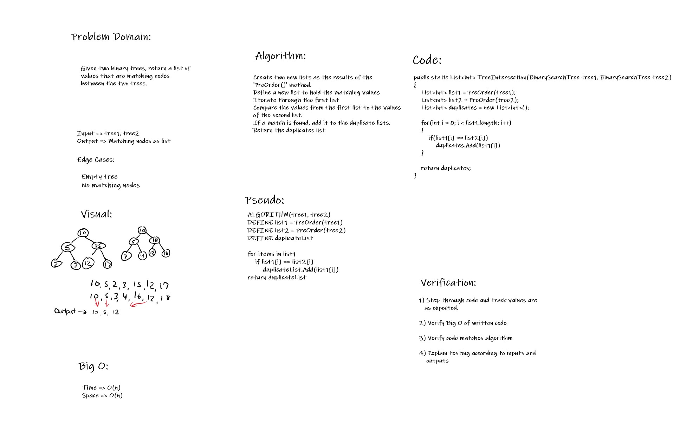

# Repeated Words

Code Challenge 32

*Author: Andrew Smith*

---
### Description

This code challenge focuses on binary search trees and implements the previously built binary search tree data structure from code challenge 15. 
The objective of this challenge is to be more comfortable with trees and compare there node's values against each other. 

---

### Visual

---

### Method Descriptions

- `TreeIntersections(tree1, tree2)`
  - Given two binary search trees, return the matching nodes in a list.
- `PrintList(list)`
  - Given a list of integers, prints out all of the integers in a row to the console.

---

### Method Approaches

- `TreeIntersections(tree1, tree2)`
  - Create two lists from the result of using `PreOrder()` on both binary search trees. 
  - Define a new list that will hold all the matching values.
  - Loop through the first list created and compare its values with the second 
    - if they match, add it to the duplicates list
  - return the duplicates list
- `PrintList(list)`
  - Loop through given list and print out all items to the console

---

### Change Log

1.3 - Whiteboard - 18 AUG 2020
1.2 - Unit test for TreeIntersections() - 18 AUG 2020
1.1 - PrintList() - 18 AUG 2020
1.0 - TreeIntersections() - 18 AUG 2020
