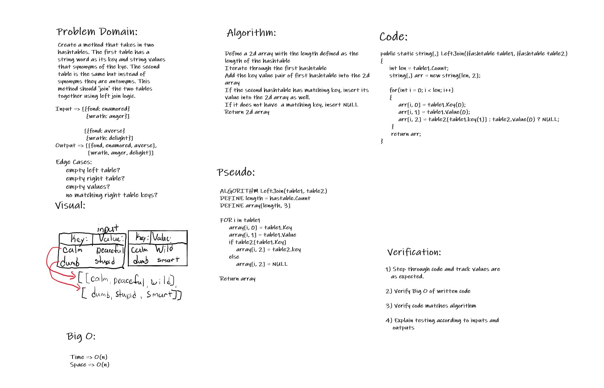

# Left Join

Code-Challenge 33

*Author: Andrew Smith*

---

### White Board

---

### Method Description

- `LeftJoinHashtables(table1, table2)`

Accepts two hashtables representing tables, each hold a string key value pair. The key is a word, the value is 
a synonym (except the second tables value is an antonym). Combines each key from both tables into a 2d array.

---

### Method Approach

- `LeftJoinHashtables(table1, table2)`
  - Define a 2d array
  - Iterate through first table
    - Add its key value pair into the 2d array
    - Check if the second table has the same key
    - If it does then insert into the 2d array as well
    - If it does not then insert NULL into the 2d array
  - return the 2d array

---

### Efficiency 

- Time - O(n)
- Space - O(n)

