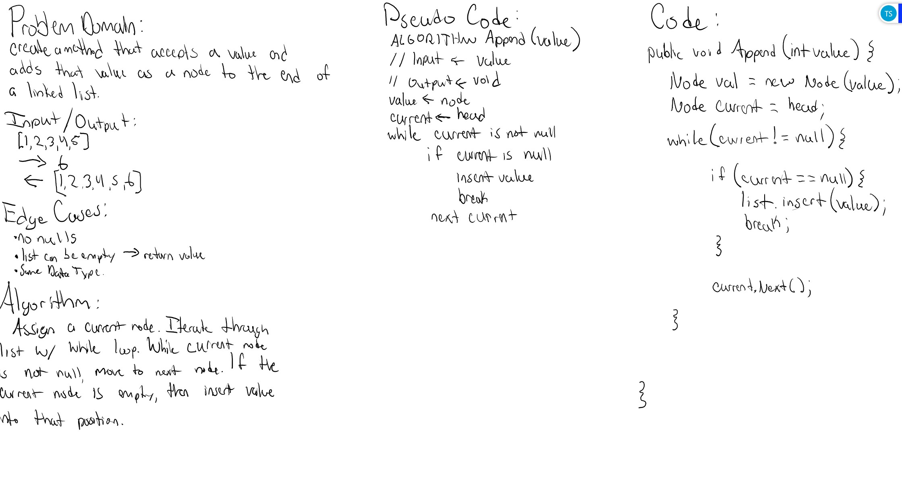
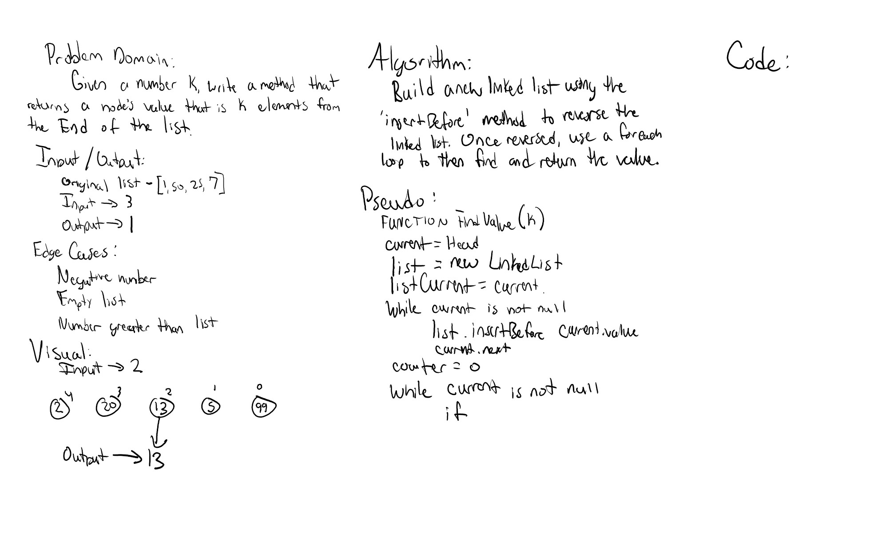

# Linked List Library

*Author: Andrew Smith*

---
### Description

A linked list library to reference in other projects. This library contains code
that creates a linked list from scratch. WhiteBoard Solutions
### Method Descriptions
* KthFromEnd() - Return the node's value that is kth nodes from the end of the list
* Insert() - Adds new node to the front of the linked list. O(1) time operation
* Append() - Adds node to the end of a linked list
* InsertBefore() - Insert the passed in 'value' directly before the passed in 'newValue'
* InsertAfter() - Insert the passed in 'value' directly after the passed in 'newValue'
* Includes() - Finds a value in the linked list
* ToString() - Overriding current behavior of toString method to output all values in the linked list as a string

### Method Approaches
**KthFromEnd:** - O(n)

Use a while loop to iterate over the linked list and calculate its length and store in a variable
'listLen'. Subtract the passed in value 'k' from the 'listLen' and store in variable 'target'. WhiteBoard SolutionsInitialize a 'count' variable to 1 then iterate over the list a second time. When the target
value matches the count variable, return the current nodes value.

**InsertBefore:** - O(n)

Create a new node holding the value of the passed in 'newValue'. Establish a current node with the value
of the 'Head'. Using a while loop, iterate through the list and check each nodes value to see if it
matches the passed in 'value'. If a match is found, insert the 'newNode' directly before the matching
value. 

**InsertAfter:** O(n)

Create a new node holding the value of the passed in 'newValue'. Establish a current node with the value
of the 'Head'. Using a while loop, iterate through the list and check each nodes value to see if it
matches the passed in 'value'. If a match is found, insert the 'newNode' directly after the matching
value.

**Append:** - O(n)
Create a new node holding the value of the passed in 'newValue'. Establish a current node with the value
of the 'Head'. Using a while loop, iterate through the list until the 'current.Next' value is null. If
'current.Next' value is null, then insert the 'newValue' into the 'current.Next' position.

**Insert:** - O(1)
Create a new node with value that was passed in and assign the 'node.Next' as the 'Head'. Then, assign the 'Head'
as the new node.

**Includes:** - O(n)
Assign 'current' as head. Iterate through the linked list with a while loop. Check each node to see if its value
to see if it matches the passed in 'value'. If a match is found, return true. Otherwise return false.

**ToString:** - O(n)
Assign 'current' as head. Initialize a 'StringBuilder' variable. Iterate through the linked list with a while loop.
On each pass, use the existing 'Append()' method to append the current value to the StringBuilder variable. Once
finished, return the StringBuilder variable.

---
### WhiteBoard Solutions

**Append() method**

---
**KthFromEnd() method**

---
### Change Log

June 14 2020
* KthFromEnd() method

June 13 2020
* Append() method
* InsertBefore() method
* InsertAfter() method

10 June 2020
  * LinkedList library
  * LInkedList unit tests
